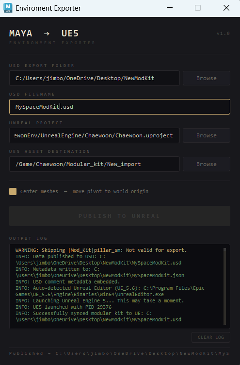

# ModKit_USD_Maya_to_Unreal_exporter
### Onedirectional USD Pipeline exporter for enviroment artists exporting modular kits.
This tool, will grab your maya modular kits selection and automatically export as a single USD file and reimport the meshes as individual SM in Unreal. The goal was to implement asset transfer between Maya and Unreal, and starting to dive into USD as a topic. For these modular kit workflow, I publish a compact single USD package optimized for automated Unreal import.

# Demo Videos:
Click to see the Demo:

[](https://vimeo.com/1198864885?share=copy&fl=sv&fe=ci)

# Current Features (V.1.0.0):
### Modular Kit Exporter from Maya
* Exports the selection in a single USD file for optimized for automated import.
* Directory selection for Unreal, USD file destination folder, and Output folder.
* Write metadata on artist, time and dump into a JSON sidecar file.
  
# How to install:

### Method 1: Standard Installation (Recommended for Artists)

**1. Download the Package**
* Click the green **Code** button and select **Download ZIP**.
* Extract the contents of the ZIP file to a location on your computer.

**2. Copy to your Maya Scripts Folder**
* Open your local Maya scripts directory. By default, this is located at:
  * **Windows:** `C:\Users\<YourUsername>\Documents\maya\<maya_version>\scripts`
  * **Mac:** `~/Library/Preferences/Autodesk/maya/<maya_version>/scripts`
  * **Linux:** `~/maya/<maya_version>/scripts`
* Copy the `environment_exporter` folder from the extracted ZIP and paste it directly into your Maya `scripts` folder.
  
**3. Launch the Tool in Maya**
* Open Autodesk Maya.
* Open the **Script Editor** (`Windows > General Editors > Script Editor`).
* Create a new **Python** tab and paste the following execution code:

  ```python
  import enviroment_exporter
  environment_exporter.launch()

### Method 2: Command line installation.

***1. Download the Package**
* Open your terminal and write
  ```
  git clone [https://github.com/alex-negrete-ta/ModKit_USD_Maya_to_Unreal_exporter.git](https://github.com/alex-negrete-ta/ModKit_USD_Maya_to_Unreal_exporter.git)

***2. Install the package into Maya**
* Navigate to the root folder of the tool in your terminal and execute>
  ```
  "C:\Program Files\Autodesk\Maya<version>\bin\mayapy.exe" -m pip install .

**3. Launch the Tool in Maya**
* Open Autodesk Maya.
* Open the **Script Editor** (`Windows > General Editors > Script Editor`).
* Create a new **Python** tab and paste the following execution code:

  ```python
  import enviroment_exporter
  environment_exporter.launch()

# Quick Start:
### First time setup.
Make sure that you have the right plugins enabled in Unreal Engine and that the Maya you are working is newer than Maya 2022+

### Basic Workflow.
* After you have your modular kit, select all the meshes you want to export and open the software.
* First select the folder where you want the USD and json file to be exported into.
* Write the name of the USD file you would like.
* Select the .uproject file you want to import your modular kit into.
* And select the folder inside your unreal project where you want to import your modular kit.

It will automatically open your project and import the meshes if the right plug ins are enabled.

# Current Limitations:
* It does not export a live link between the projects.
* It opens a new instance of Unreal Engine.
  
# File Reference:
### Maya Scripts:
* <u>enviromentexporter_ui.py</u> It navigates the Pyside logic and UI.
* <u>maya_unreal_enviroments.py</u> It handles the Meshes logic export logic.
* <u>logger.py</u> It handles the logging input into the UI.
* <u>unreal_laoder.py</u> Handles the finding of UE5 in your system and the subproccess logic.
* <u>usd_importer_ue5.py</u> Handles the import of the USD assets inside Unreal.
* <u>Constants.py</u> It handles the constants in the tool such as version number and title.

# Requirements:
### Maya:
* Maya 2022+

### Unreal
* USD importer
* Python Editor Script Plugin


